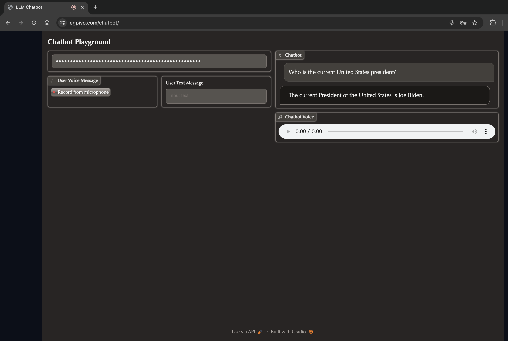

# Chatbot
<p /center>
  <a href="https://github.com/egpivo/chatbot/actions"></a>
  <a href="https://codecov.io/gh/egpivo/chatbot"></a>
  <a href="https://hub.docker.com/r/egpivo/chatbot/tags"></a>
  <a href="https://hub.docker.com/r/egpivo/chatbot/tags"></a>
  <a href="https://hub.docker.com/r/egpivo/chatbot/tags"></a>
</p>
<link rel="stylesheet" href="https://cdnjs.cloudflare.com/ajax/libs/font-awesome/5.15.3/css/all.min.css" integrity="sha512-...." crossorigin="anonymous" />


## Installation

To get the Chatbot Python package from this GitHub repository, use the following command:

```bash
pip install git+https://github.com/egpivo/chatbot.git
```
## Serving Automation
This repository automates the process of checking and fine-tuning pre-trained models for the Chatbot application. The automation script allows you to customize SpeechT5 and SWhisper models and enables retraining if needed.

### Serving Process Flow

```mermaid
graph TD
  A[Check if Model Exists]
  B[Fine-Tune Model]
  C[Load BentoML Configuration]
  D[Serve the App]
  E[Check SSL Certificates]
  F[Generate Dummy SSL Certificates]

  A -- Yes --> C
  A -- No --> B
  B --> C
  C --> D
  D --> E
  E -- No --> F
  E -- Yes --> D

```

### Artifact Folder
During the model serving process, the `artifacts` folder is used to store the BentoML artifacts, essential for serving the Chatbot application.
## Usage
### Local Model Serving
#### Default Model Values
Run the Chatbot service with default model values:
```shell
make local-serve
```
#### Customizing the Serving Process
Customize the Chatbot serving process using the automation script. Specify your desired models and options:

```shell
bash scripts/run_app_service.sh \
  --t5_pretrained_model {replace_with_actual_t5_model} \
  --t5_pretrained_vocoder {replace_with_actual_t5_vocoder} \
  --whisper_pretrained_model {replace_with_actual_whisper_model} \
  --is_retraining
```
- **Note**: Replace `{replace_with_actual_t5_model}`, `{replace_with_actual_t5_vocoder}`, and `{replace_with_actual_whisper_model}` with your preferred values. Adding the `--is_retraining` flag forces model retraining.


### Model Serving via Docker
#### By Makefile:
```shell
make docker-serve
```

#### By `docker` CLI
- DockerHub
  ```shell
  docker run -p 443:443 egpivo/chatbot:latest
  ```
- GitHub Package
  ```shell
  docker run -p 443:443 ghcr.io/egpivo/chatbot:latest
  ```
### Client Side
Access the demo chatbot at `https://{ip}/chatbot`, with the default values being `0.0.0.0` for the `ip`.

- Note: Dummy SSL certificates and keys are created by default for secure communication if `key.pem` and `cert.pem` do not exit in `artifacts/`. Or you can replace them manually.

## Demo <i class="fas fa-eye fa-lg"></i>
- Explore the demo site hosted on Alibaba Cloud via https://egpivo.com/chatbot/.


- Note: This site is intended for demo purposes only, and there is no guarantee of computing efficiency.

## Remark
- Reference: [BentoChain Repository](https://github.com/ssheng/BentoChain)
- **License:** [BSD 2-Clause License](LICENSE)
